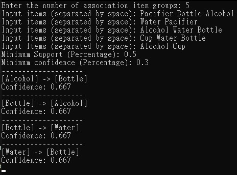

# Association Rule Mining Example

This project demonstrates the process of association rule mining using the Apriori algorithm. The user can input groups of associated items and define minimum support and confidence thresholds. Based on these inputs, the program will output association rules with their respective confidence levels.

## Example Input
```
Enter the number of association item groups: 5
Input items (separated by space): Pacifier Bottle Alcohol
Input items (separated by space): Water Pacifier
Input items (separated by space): Alcohol Water Bottle
Input items (separated by space): Cup Water Bottle
Input items (separated by space): Alcohol Cup
Minimum Support (Percentage): 0.5
Minimum confidence (Percentage): 0.3
```

## Result
```text
--------------------
[Alcohol] -> [Bottle]
Confidence: 0.667
--------------------
[Bottle] -> [Alcohol]
Confidence: 0.667
--------------------
[Bottle] -> [Water]
Confidence: 0.667
--------------------
[Water] -> [Bottle]
Confidence: 0.667
```
Here is the output screenshot for the provided example:



## How it Works

1. **Input**: The user enters a number of item groups. Each group consists of a list of associated items, inputted by the user.
2. **Minimum Support & Confidence**: The user specifies the minimum support and confidence thresholds to filter frequent itemsets and association rules.
3. **Output**: Based on the inputs and thresholds, the program calculates association rules and prints them along with their confidence.


## Information
- **Author**: Feng-Hao, Yeh
- **Email**:
  - Recommended: zzz3x2c1@gmail.com
  - Alternate: yeh.feng.hao.110@gmail.com
  - Work: yeh.feng.hao@try-n-go.com